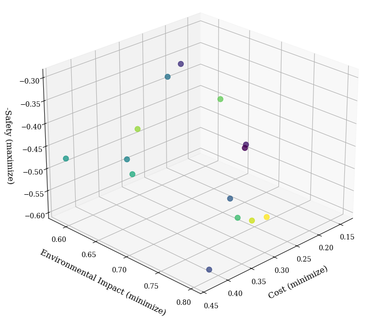
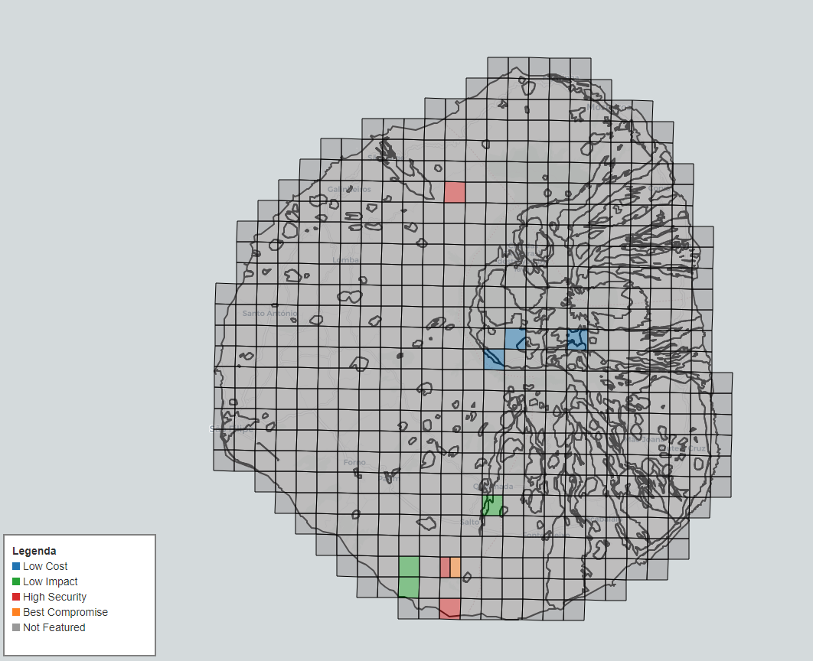

## NSGA-II GIS Landfill Optimization: Fogo Island, Cape Verde

🔍 **A multi-objective optimization framework for sustainable landfill site selection on Fogo Island, Cape Verde, using GIS and NSGA-II.**

---

### 🌟 Key Features

- **Multi-Objective Optimization** with NSGA-II algorithm
- **GIS Integration** analyzing 11 geospatial criteria
- **Real-World Case Study** for Fogo Island, Cape Verde
- **Data-Driven Decision Support** with AHP-weighted solutions
- **Open-Source Implementation** using Python geospatial stack

---

### ⚙️ Methodology & Workflow

- **Spatial Grid Generation** - Systematic candidate site creation
- **Criteria Analysis** - Quantitative evaluation of 11 factors
- **NSGA-II Optimization** - Pareto front generation
- **Solution Selection** - Weighted compromise analysis

---

### 📂 Repository Structure

### Pareto Front

The optimization resulted in a Pareto Front composed of 14 non-dominated solutions. The 3D scatter plot below illustrates the trade-off between the three conflicting objectives. Each point represents a valid combination of three landfill sites where no single objective can be improved without compromising another.



---

### Spatial Allocation of Optimal Sites

The map below visualizes the geographic distribution of the top-performing solutions for each objective, as well as the final Best Compromise Solution.



- 🟦 **Low Cost:** These three sites are located near existing infrastructure and in areas with favorable topography to minimize construction costs.
- 🟩 **Low Impact:** These three sites are positioned to minimize ecological sensitivity, located away from protected areas and water bodies.
- 🟥 **High Security:** These three sites are farthest from population centers and high-risk zones like the aerodrome, maximizing social safety.
- 🟧 **Best Compromise:** The site selected via weighted scoring. Interestingly, it shares the same spatial quadrant as one of the high-safety sites, highlighting its robust, balanced profile.

---

## 🚀 Getting Started

```
NSGA2-GIS-Landfill-Optimization-Cape-Verde/
│
├── code/
│   ├── Landfill_Site_Selection_Grid_Analysis.ipynb  # Phase 1: Grid generation & visualization
│   ├── Landfill_Site_Optimization_NSGA2_GIS.ipynb   # Phase 2: Criteria analysis & optimization
│
├── data/                                            # All necessary data for run the codes
│
├── img/                                             # All images used in the paper
│
├── LICENSE
└── README.md                                        # This file
```

---

### 🚀 Getting Started

**Prerequisites**

- Python 3.8+
- GeoPandas ecosystem
- PyMoo for optimization

**Installation**

```bash
git clone https://github.com/your-username/NSGA2-GIS-Landfill-Optimization-Cape-Verde.git
cd NSGA2-GIS-Landfill-Optimization-Cape-Verde
conda env create -f environment.yml
```

---

### 📥 Data Download

The required geospatial datasets must be downloaded manually from the following Google Drive link:

[Download Data](https://drive.google.com/drive/folders/1I382_NkI-qb3mvULdjaBCKli6nT6XPyY?usp=sharing)

Download the data before running the notebooks.

---

### 📄 Citation

If you use this work in your research, please cite:

@software{azancort_neto_2024,
author = {Azancort Neto, Julio Leite},
title = {NSGA2-GIS-Landfill-Optimization-Cape-Verde},
year = {2024},
publisher = {GitHub},
journal = {GitHub repository},
howpublished = {\url{https://github.com/yourusername/NSGA2-GIS-Landfill-Optimization-Cape-Verde}}
}
=======

---

### 📜 License

Apache 2.0 - See LICENSE for details
